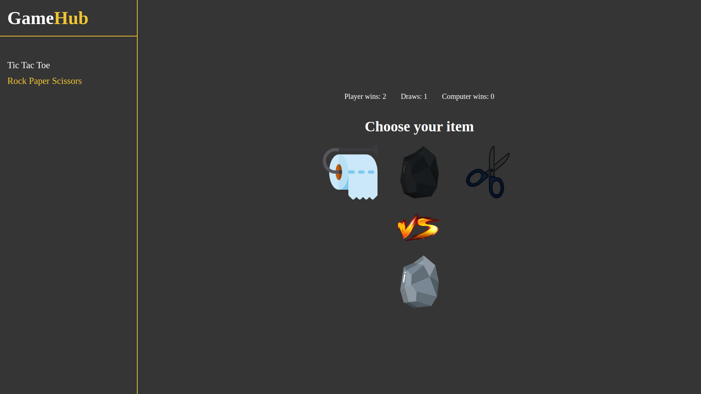

## 0. This is my angular learning project. This is a site with simple games. So far it has two games. I plan to add more.

## 1. Technologies
* "@angular/core": "^14.2.0",
* "typescript": "~4.7.2"

## 2. What I learned in this project:
* Writing my own Angular Pipes
* Creating Angular Components, Services and Routing

## 3. Screens

